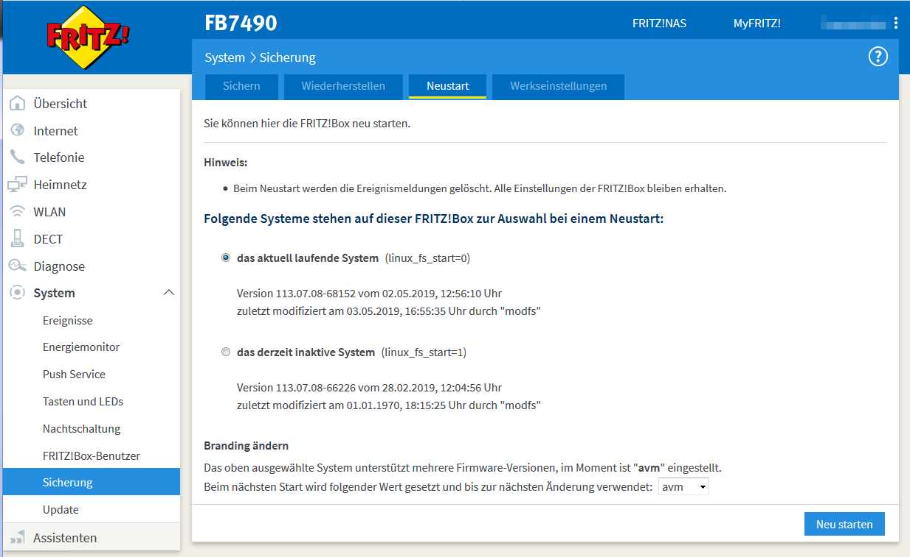

# Files in this folder

`bootmanager`

It's a meanwhile outdated shell script to switch the active operating system on a FRITZ!Box device from command line. This one was able to manage different sets of settings for each system.

`gui_bootmanager`

It's a shell script, intended to be called on a FRITZ!Box device with VR9/GRX500/Puma6 chipset, which has the ability to switch between two different installed operating systems. It's at the same time an attempt to equalize the special needs of each of these models, how to manage the installed filesystem images in SquashFS format.

It provides different modes of operation:

- generate the HTML and JS code needed to include its functions into vendor's restart page
- generate a list of current settings, which may be used by the caller to implement an own user interface
- switch the active system version and branding in a secure and reusable manner

German and English messages are included in the script, the default language is ```en``` and it will be switched by the environment setting from FRITZ!OS (```Language``` variable) to ```de```, if this value is present in the calling system.

The code checks, if any of the present systems was modified by a supported framework (```YourFritz```, ```Freetz``` or ```modfs```) and shows the date and time of last update, if it detects any of these frameworks. Finally, it's simply looking for the various version files and uses the file date and time of them to display the values.

To install it to your own firmware image, best copy it to location ```/usr/bin/gui_bootmanager``` and set the wanted attributes and owner/group ID. The other files from here expect it there ... if you put it elsewhere, you probably have to change the location in other files, too.

`add_to_system_reboot.sh`

A shell script, which adds the needed code to AVM's files to integrate `gui_bootmanager` into the 'Reboot' page from GUI. It supports the pre-07.08 approach, where HTML code is emitted from `reboot.lua` and also the newer one, where only JSON data gets generated.

If your firmware image contains more than a single *branding*, you'll probably need to apply the patch to more than one sub-tree below ```/usr/www```.

The use of `sed` to change the original content forecloses any protection against double invocation for the same file and it's the caller's business to prevent errors from double-patch attempts.

You have to set the environment variables 

- `TARGET_BRANDING` (e.g. `avm`)
- `TARGET_SYSTEM_VERSION` (e.g. `113.07.08`)
- `TARGET_DIR` (root of filesystem to modify) and
- `TMP` (a writable place in your system for a temporary file)

to the correct values, before you call this script.
